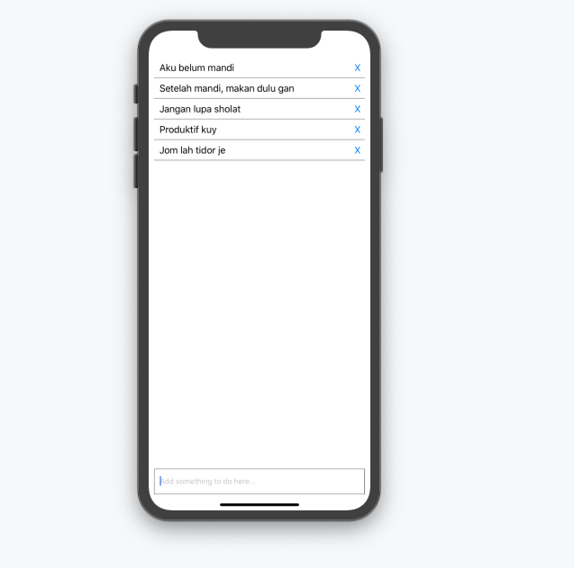

# WhatToDo-RN
A what to do application made using React-Native.

# Usage

Follow the instructions below:

```sh
First, make sure you have already installed Expo on your device.

Secondly, clone/download the repo.

Third, install the needed dependencies (npm install || yarn add).

Fourth, run the application!

```

# Results
After running the app, you'll be on this kind of screen where you can enter something, and delete it.



## Licensed under the [MIT](https://raw.githubusercontent.com/hasimy-as/WhatToDo-RN/master/LICENSE) License.

Happy coding!
~Hasimy


